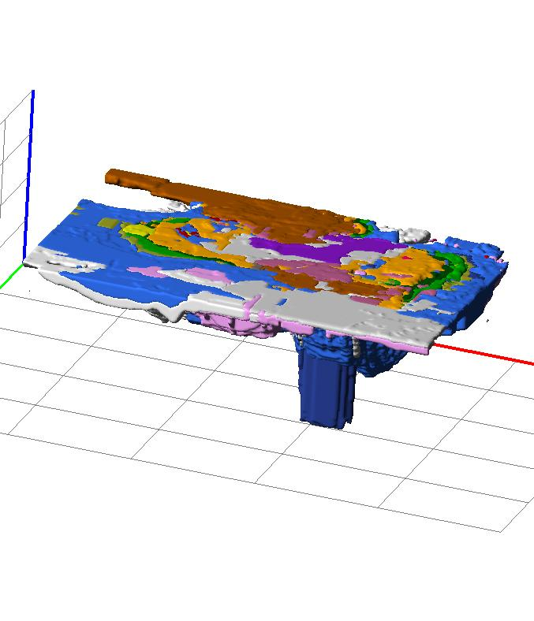
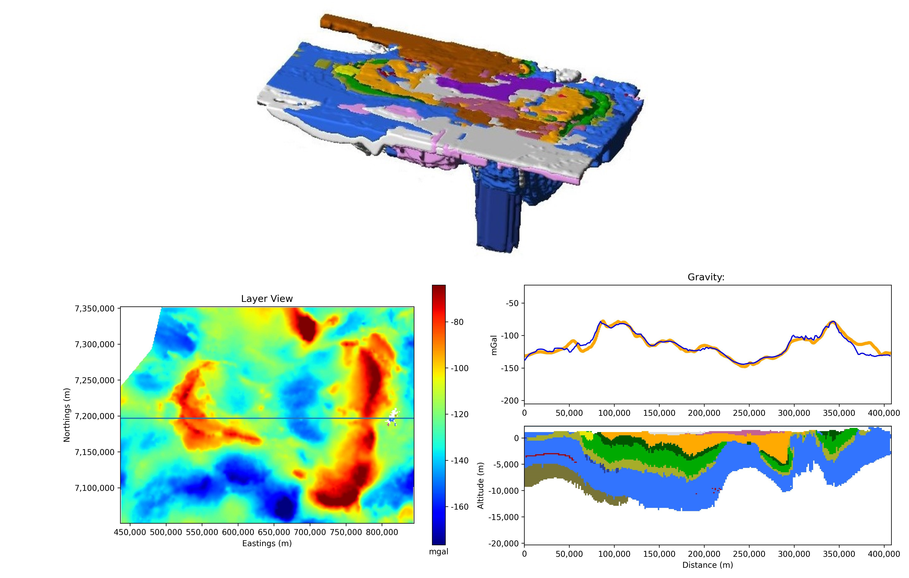

# Summary

Python Geoscience Modelling and Interpretation (PyGMI) is an open-source software development project, programmed in Python. The main aim of PyGMI is to provide a free geoscientific tool for processing, interpretation and modelling of geoscience data. It also allows for research into better ways to process, analyse and model data and as such is continually updated to implement these advances.
Although is was originally intended to create voxel based three dimensional potential field models, it expanded to include tools for the processing and visualisation of raster data, import and visualisation of vector data (normally collected in surveys along lines), unsupervised and supervised cluster analysis, gravity processing, remote sensing processing and quality control tools for earthquake seismology.

# Statement of Need
Geophysical data provide geoscientists with the ability to create a picture of the subsurface prior to more expensive endeavours such a drilling or for further research using complementary data sets. The best way to present such a picture is through 3D models. The original concept of PyGMI was a desire to have an effective 3D forward modelling package for magnetic and gravity data. There are a number of basic strategies to do this. One conventional approach follows the modelling of individual profiles, which are then “joined” up into 3D sections. Another is to form bodies from arbitrary polygonal shapes. However, using such methods, the time it takes to construct a 3D model can be prohibitive. Conventional polygonal based 3D modelling programs (3DS Max, Maya, Blender) are akin to CAD packages and require a steep learning curve, which is not always possible or tolerated by many scientists. PyGMI follows a voxel based approach (which is also used commonly in geophysical inversion), allowing the model to ‘drawn’ in on model slices or layers, much like using an art program. Each voxel is assigned a lithology from user defined list, with its associate geophysical definitions.
There are many techniques which can be considered here [@Bhattacharyya1964; @Guptasarma1999; @Singh2001a; @Singh2001b; @Holstein2003]. In this case the technique by @Bhattacharyya1964 was used, being most applicable for voxel modelling. The simplicity of the technique makes it well suited to rectangular prism calculations. It is described and developed into a Fortran routine, named ‘mbox’ by @Blakely1995 (pp. 200-201).
 

Standard raster functions such as equations (making use of the NumExpr library, https://github.com/pydata/numexpr), smoothing, normalisation, merging of datasets and reprojections [courtesy of @gdal2020] are included. Functions unique to potential fields such as tilt angle [@Cooper2006], visibility [@Cooper2005], reduction to the pole, sun shading [@Horn1981], IGRF calculations [@igrf2015, based on code by written by A. Zunde, USGS, S.R.C. Malin & D.R. Barraclough, Institute of Geological Sciences, United Kingdom and maintained by Stefan Maus, NOAA] have all been translated into or developed in python. The sun shading tool in particular allows for sunshade detail and light reflectance to be changed. These two parameters are not normally present in other software packages which normally only allow for the changing of sun dip and azimuth.
Gravity data processing has been developed according to the North American gravity database standards, as described by @Hinze2005. It allows for data to be imported from Scintrex CG-5 gravimeters and basic processing to Bouguer anomaly to be performed.
Earthquake seismology QC tools for the open source SEISAN platform [@Havskov2020] have been implemented. These include various plotting functions including RMS of time residuals, histograms of events vs time, b-values and error ellipses. Filtering of events can be performed via a filtering tools. A fault plane solutioin tool is also implemented, translated from code written by Andy Michael and Oliver Boyd (http://www.ceri.memphis.edu/people/olboyd/Software/Software.html) and is capable of exporting results to the shapefile format.
Crisp and fuzzy cluster analysis routines developed by @Paasche2009 in a joint project with the Council for Geoscience are provided, as well as supervised and unsupervised routines developed via the Sklearn library [@Pedregosa2012]. A graphical tool to see class representations via a scatterplot is provided. The tool allows for interactive relationships between scatterplots and the data to be examined. Image segmentation following the method by @Baatz2000 has also been implemented. 
Remote sensing tools are one of the major new focuses of PyGMI. Numerous major satellite formats are implemented though the GDAL library, including Sentinel-2, ASTER and Landsat, to name a few. PyGMI’s focus is to enable convenient calculation of a variety of measures, including predefined band ratios, condition indices, PCA (principal component analysis) and MNF [minimum noise fraction, @Green1988]. Change detection indices are also implemented as well as a viewer for change data. Finally, hyperspectral data analysis though feature detection is also possible [@Haest2012].
The PyGMI interface has been designed in a flow chart manner. This enables the user to see each step of the processing flow, useful in both debugging a process or teaching to new users. It also allows greater flexibility between modules.
The PyGMI project therefore aims to continue to grow and support research and development in geosciences by providing easy to use tools with a GUI frontend.

# Acknowledgements

The author would like to acknowledge the Council for Geoscience for providing resources to allow for the continued development of PyGMI. In addition the author would like to thank all users for the reporting of bugs and suggesting of useful features for PyGMI.

# References

